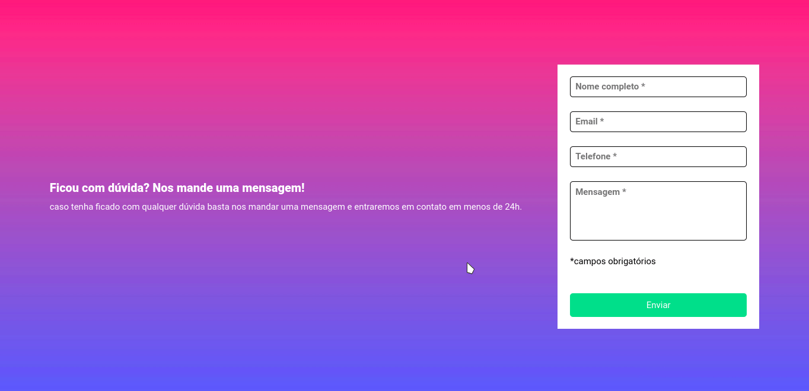

# Form using JavaScript - DevQuest Intermediate Challenge

Form created using validation through JavaScript.

This project was created as a **DevQuest** training challenge provided by the [**Dev em Dobro**](https://www.instagram.com/devemdobro/) team.

Users should be able to:

- Fill in the form with the requested information.
- If one or more fields are empty, an error message should appear.
- If all fields are filled in, the user should have a visual feedback indicating that everything is ok.

## Overview
### Built with

- HTML5
- CSS custom properties
- CSS Flexbox
- JavaScript

### Links

- Live Site URL: [Form using JavaScript](https://leozizz.github.io/desafio-devquest-js-intermediario/)

### Preview

Below are some previews of the form with validation indications and in different screen sizes.

#### Desktop Preview

#### Mobile Preview

## Author

- Website - [Leonardo Silva - leozizz](https://leozizz.github.io)
- LinkedIn - [Leonardo Silva](https://www.linkedin.com/in/leozizz/)
- GitHub - [leozizz](https://github.com/leozizz)

## Acknowledgments

I thank the entire [**Dev em Dobro**](https://www.instagram.com/devemdobro/) team that has been helping me through the **DevQuest** training where I am having the opportunity to learn and improve my skills in Front-end development and for all the mentoring and help available.